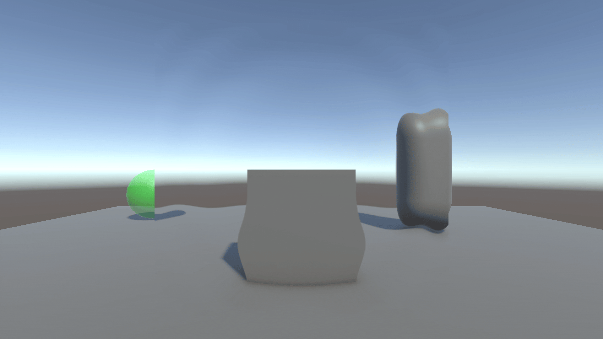
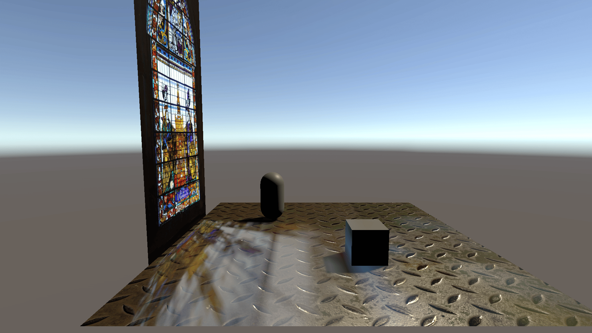
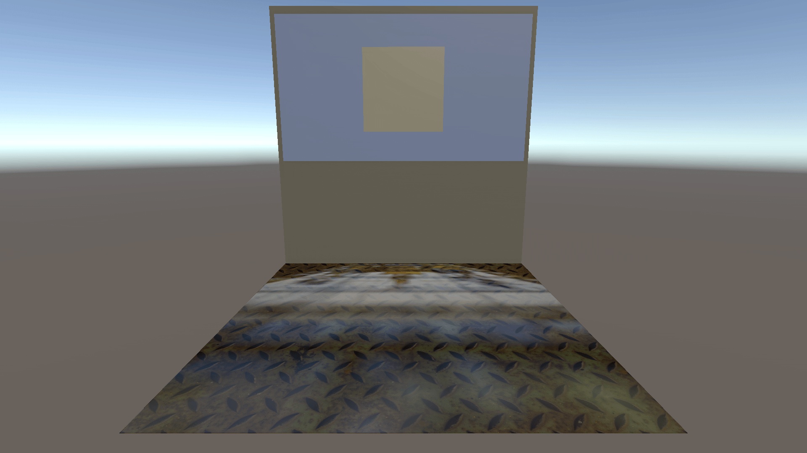
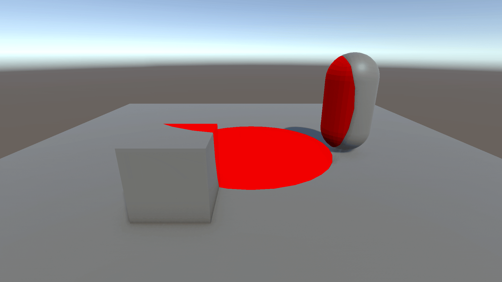
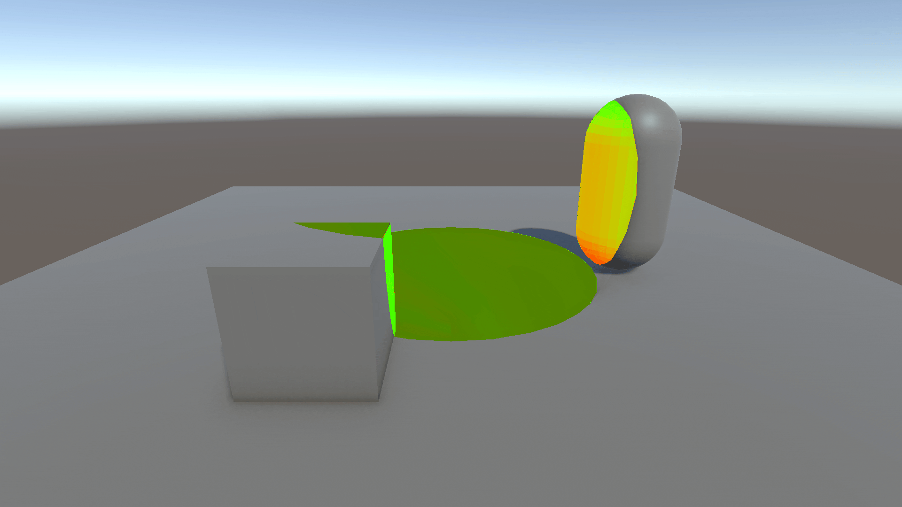

# レンダーターゲット/レンダーテクスチャ

## はじめに

プログラムワークショップⅣの管理用です

## 結果画像

### 不透明フレームバッファへのアクセス

### 深度からの位置・法線の復元

### ゲーム内モニター

### バックミラー

### 範囲内のオブジェクトだけ単色

### あなたの考えた素敵なシェーダー

- 工夫した点
  - 色が時間経過で変化するようにしました。

## 進め方

- 本リポジトリ (tpu-game-2025/PGWS4_10_rendertexture)をforkしてください
- fork先のリポジトリを更新してください
- Unityのプロジェクトをsrc内で進めてください
- 結果を画面キャプチャして、画像としてリポジトリに追加して、上記のリンクから見られるようにしてください
- 完成したら本リポジトリのmainブランチにpull requestを投げてください
